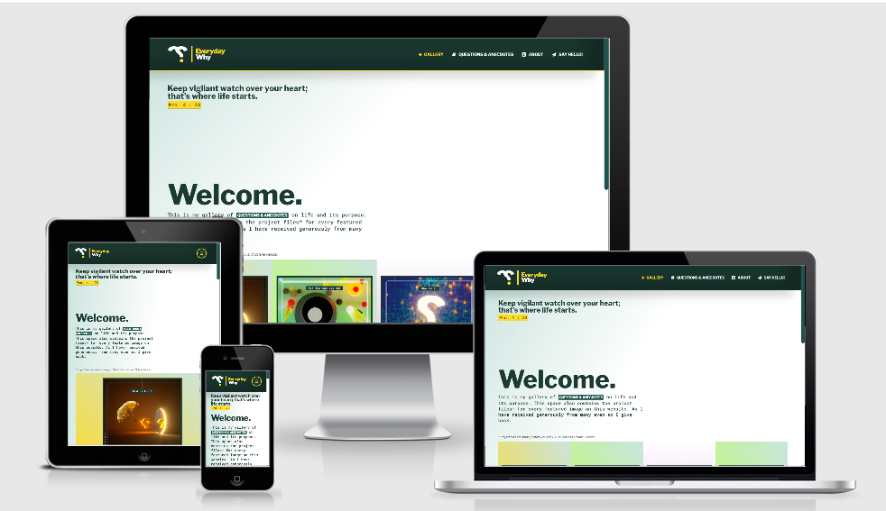
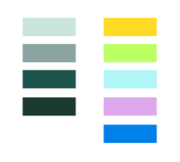

<a href="https://rexayo.github.io/everyday-why"></a>

##### Click logo above to view live project

<h2 align="center"></h2>

EverydayWhy is a passion project that sits at the intersection between a Personal Design Diary and Christian Apologetics. According to Wikipedia, Christian apologetics is a branch of Christian theology that defends Christianity against objections.

As a visual artist I have always struggled with finding subject matter that represents my interests and defines my belief system. I stumbled upon Chrsitian Apologetics and found its focus both exciting and challenging to represent from the eye of a creator. EverydayWhy is born of that desire to represent my thoughts, questions and perceptions about life in a way that would hopefully be of interest to designers, design enthusiasts, christians and all those with similar questions.

As a personal design diary, I also intend to use it as a platform to share my knowledge on my preferred design tools, primarily Side FX Houdini and Adobe After Effects . Knowledge about using Houdini as a design tool isn't so commom place and I feel that it would be a nice addition to make my project files available for download. Also, a future update would be to add a section for tutorials

It is my desire that I can create a hub to share my journey in visual communication, as well as, making an online space that represents my interests and skills, so as to also attract design collaborations and commisions from people with similar interests.

I am grateful for the knowledge I have gained so far on this course as it has enabled create something that was only just an imagination a few months ago.

## User Experience (UX)

- ### User Stories

    - #### First Time Visitor Goals

        a. As a First Time Visitor, I want to easily understand the main purpose of the site and learn more about the creators.    
        b. As a First Time Visitor, I want to be able to easily navigate throughout the site to find content.  
        c. As a First Time Visitor, I want to easily find information about the author of the website and I want to be able to easily locate their social media links to see their followings on social media to determine how trusted and known they are.

    - #### Returning Visitor Goals

        a.  As a Returning Visitor, I want to be able to easily download images and project files.  
        b.  As a Returning Visitor, I want to find the best way to get in contact with the organisation with any questions I may have.  

    - #### Frequent User Goals

        a. As a Frequent User, I want to check to see if there are any newly added articles or images.  
        b. As a Frequent User, I want to sign up to the Newsletter so that I am emailed any major updates and/or changes to the website or organisation.


- ### Design
    - #### Colour Scheme
        -   The colour scheme across the website is a combination of gradients and solid fills based on the colours below.  
        <h2></h2>
    - #### Typography
        -   The Google fonts Libre Franklin and Roboto Mono are the two fonts used across the website with Sans Serif and Monospace as the alternative fonts respectively, for cases when the default options aren't loaded onto the website correctly.
        Both fonts are very legible and contrast nicely together. With Libre Franklin serving as the primary font for headlines and titles and Roboto Mono as the body text. 
    - #### Imagery
        -   Images across the website play a huge role and a created to be analogous to the sites colour palette. 
    - #### Negative Space
        -   Negative Space helps to give the viewer some breathing space between both the images and Article section which typical has a lot of text. 

*   ### Wireframes

    Initial Wireframes developed at the start of the project are <a href="assets/images/RexAbba-AbbaMilestoneProjectWireframe.pdf" download>here.</a> One difference that can be observed is that I decided to make the Downloads & Resources page into the homepage which is now called Gallery. This choice to help easy navigation and provide a more welcoming homepage with appealing images. 

  

## Features

This section contains all the features of the website

### Gallery

This is the homepage and hub for all the images and downloads. Each image has three anchor tags:

- A download link to a high resolution version of the image.
- A download link to the project files and assets used to make the image and
- A link that takes to the user to the related article.

### Questions & Anecdotes

This is a collection of articles on a range of questions, structured with collapsible accordion panels.
Each article is intended to inspire or ignite more questions.

### About

This has a little bit of a bit of information concerning me and the motivation behind the EverydayWhy.

### Say Hello

This page contains features that helps the user make inquiries, sign up for email updates and follow social media handles.
The implementation uses Bootstrap's modal with three main features:

- An inquiry form which allows user to ask questions or send comments by filling out required fields.
- A email field which enables users sign up for a newsletter.
- Icons with links to EverydayWhy's social media platforms.


### Features Left to Implement

- Article archives with indexing will be useful to include as the number of articles increase. This would help the user easily find articles based around keywords. 
- A merchandise section with items connected to articles and branded with themes connected to their images.
- A tutorial section with timelapse or narrated tutorials around the creation of selected Article artwork. 

## Technologies Used

### Languages Used

- HTML5
- CSS3
- jQuery 

### Frameworks, Libraries & Programs Used

- [Bootstrap](https://getbootstrap.com/)

  - The project uses Bootstrap's library to aid responsiveness across various screen sizes and devices.

- [JQuery](https://jquery.com)
  - Bootstrap includes jQuery, which is used in both the navbar responsiveness and accordion panels. 
  - The smooth scroll feature of the "Questions & Anecdotes" page uses jQuery. 
  - The "About" tab animates on using jQuery.

- [Google Fonts](https://fonts.google.com/)
    - Google fonts were used to import the 'Libre Franklin' and the 'Roboto Mono' font into the style.css file which are used on all pages throughout the project.

- [Font Awesome](https://fontawesome.com/)
    - Font Awesome was used on all pages throughout the website to add icons for aesthetic and UX purposes.
    
- [Git](https://git-scm.com/)
    - Git was used for version control by utilizing the Gitpod terminal to commit to Git and Push to GitHub.
    
- [GitHub](https://github.com/)
    - GitHub is used to store the projects code after being pushed from Git.

- [Side FX Houdini](https://www.sidefx.com/products/houdini/)
    - Houdini was used to create all the 3D and procedural components of the images for the Articles on the website.

- [Illustrator](https://www.adobe.com/ie/products/illustrator.html)
    - Illustrator was used to create the logo, colour palette for the website and all vector elements required in the development of Article Images.

- [Photoshop](https://www.adobe.com/ie/products/photoshop.html)
    - Photoshop was used to composite the images created from Houdini.

- [Balsamiq](https://balsamiq.com/)
    - Balsamiq was used to create the wireframes during the design process.

## Testing

The W3C Markup Validator and W3C CSS Validator Services were used to validate every page of the project to ensure there were no syntax errors in the project.

-   [W3C Markup Validator](https://jigsaw.w3.org/css-validator/#validate_by_input) - [Results](https://github.com/)
-   [W3C CSS Validator](https://jigsaw.w3.org/css-validator/#validate_by_input) - [Results](https://github.com/)

### Testing User Stories from User Experience (UX) Section

-   #### First Time Visitor Goals

    1. As a First Time Visitor, I want to easily understand the main purpose of the site and learn more about the creators.  


        1. Upon entering the site, users are automatically greeted with a clean and easily readable navigation bar to go to the page of their choice. 
        2. An image grid on the homepage presents a colourful array of all artowrk representing all articles on the website.
        3. The user has three options per image, download high resolution image, download project files and go to article which takes the user straight to the article on the questions and anecdotes page.

    2. As a First Time Visitor, I want to be able to easily be able to navigate throughout the site to find content.

        1. The site has been designed to be fluid and never to entrap the user. At the top of each page there is a clean navigation bar, each link describes what the page they will end up at clearly.
        2. At the bottom of each pages there is a back to top button to help easy scrolling when for long pages and is particularly helpful on mobile devices.
        3. On the Say Hello Page, after a form response is submitted, the page refreshes and the user is brought back to the previous page. 

    3.  As a First Time Visitor, I want to easily find information about the creators of the website and I want to be able to easily locate their social media links to see their followings on social media to determine how trusted and known they are.
.
        1. Once the new visitor has visited the Say Hello page, they will notice the social media links.
        2. Additionally there are social media links at the footer of all pages except the Say Hello page where it is in the body of the page.

-   #### Returning Visitor Goals

    1. As a Returning Visitor, I want to be able to easily download images and project files.

        1. These are clearly shown in the banner message.
        2. They will be directed to a page with another hero image and call to action.

    2.  As a Returning Visitor, I want to find the best way to get in contact with the organisation with any questions I may have.

        1. The navigation bar clearly highlights the "Contact Us" Page.
        2. Here they can fill out the form on the page or are told that alternatively they can message the organisation on social media.
        3. The footer contains links to the organisations Facebook, Twitter and Instagram page as well as the organization's email.
        4. Whichever link they click, it will be open up in a new tab to ensure the user can easily get back to the website.
        5. The email button is set up to automatically open up your email app and autofill there email address in the "To" section.


-   #### Frequent User Goals

    1. As a Frequent User, I want to check to see if there are any newly added articles or images.  

        1. The user would already be comfortable with the website layout and can easily click the banner message.

    2. As a Frequent User, I want to sign up to the Newsletter so that I am emailed any major updates and/or changes to the website or organisation.

        1. The user would already be comfortable with the website layout and can easily click the blog link

    3. As a Frequent User, I want to check to see if there are any newly added articles or images.  

        1. At the bottom of every page their is a footer which content is consistent throughout all pages.
        2. To the right hand side of the footer the user can see "Subscribe to our Newsletter" and are prompted to Enter their email address.
        3. There is a "Submit" button to the right hand side of the input field which is located close to the field and can easily be distinguished.

### Further Testing

-   The Website was tested on Google Chrome, Internet Explorer, Microsoft Edge and Safari browsers.
-   The website was viewed on a variety of devices such as Desktop, Laptop, iPhone7, iPhone 8 & iPhoneX.
-   A large amount of testing was done to ensure that all pages were linking correctly.
-   Friends and family members were asked to review the site and documentation to point out any bugs and/or user experience issues.

### Known Bugs

-   On some mobile devices the Hero Image pushes the size of screen out more than any of the other content on the page.
    -   A white gap can be seen to the right of the footer and navigation bar as a result.
-   On Microsoft Edge and Internet Explorer Browsers, all links in Navbar are pushed upwards when hovering over them.

## Deployment

### GitHub Pages

The project was deployed to GitHub Pages using the following steps...

1. Log in to GitHub and locate the [GitHub Repository](https://github.com/)
2. At the top of the Repository (not top of page), locate the "Settings" Button on the menu.
    - Alternatively Click [Here](https://raw.githubusercontent.com/) for a GIF demonstrating the process starting from Step 2.
3. Scroll down the Settings page until you locate the "GitHub Pages" Section.
4. Under "Source", click the dropdown called "None" and select "Master Branch".
5. The page will automatically refresh.
6. Scroll back down through the page to locate the now published site [link](https://github.com) in the "GitHub Pages" section.

### Forking the GitHub Repository

By forking the GitHub Repository we make a copy of the original repository on our GitHub account to view and/or make changes without affecting the original repository by using the following steps...

1. Log in to GitHub and locate the [GitHub Repository](https://github.com/)
2. At the top of the Repository (not top of page) just above the "Settings" Button on the menu, locate the "Fork" Button.
3. You should now have a copy of the original repository in your GitHub account.

### Making a Local Clone

1. Log in to GitHub and locate the [GitHub Repository](https://github.com/)
2. Under the repository name, click "Clone or download".
3. To clone the repository using HTTPS, under "Clone with HTTPS", copy the link.
4. Open Git Bash
5. Change the current working directory to the location where you want the cloned directory to be made.
6. Type `git clone`, and then paste the URL you copied in Step 3.

```
$ git clone https://github.com/YOUR-USERNAME/YOUR-REPOSITORY
```

7. Press Enter. Your local clone will be created.

```
$ git clone https://github.com/YOUR-USERNAME/YOUR-REPOSITORY
> Cloning into `CI-Clone`...
> remote: Counting objects: 10, done.
> remote: Compressing objects: 100% (8/8), done.
> remove: Total 10 (delta 1), reused 10 (delta 1)
> Unpacking objects: 100% (10/10), done.
```

Click [Here](https://help.github.com/en/github/creating-cloning-and-archiving-repositories/cloning-a-repository#cloning-a-repository-to-github-desktop) to retrieve pictures for some of the buttons and more detailed explanations of the above process.

## Credits

### Code

-   The full-screen hero image code came from this [StackOverflow post](https://stackoverflow.com)

-   [Bootstrap4](https://getbootstrap.com/docs/4.4/getting-started/introduction/): Bootstrap Library used throughout the project mainly to make site responsive using the Bootstrap Grid System.

-   [MDN Web Docs](https://developer.mozilla.org/) : For Pattern Validation code. Code was modified to better fit my needs and to match an Irish phone number layout to ensure correct validation. Tutorial Found [Here](https://developer.mozilla.org/en-US/docs/Web/HTML/Element/input/tel#Pattern_validation)

## Credits

### Content

- The text for all sections were created by my wife and I.

### Media

- The images used in this site were all designed and created by me.

### Acknowledgements

- I received inspiration for this project from websites like the rzim.org, theschooloflife.com, wearelisten.com and thebibleproject.com
